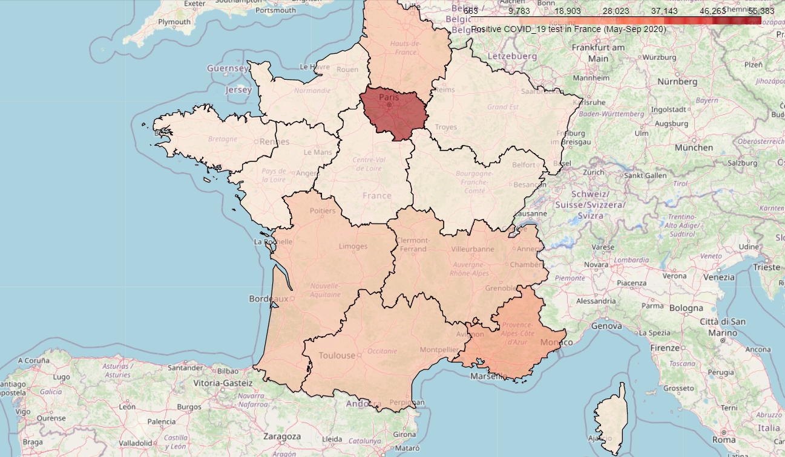
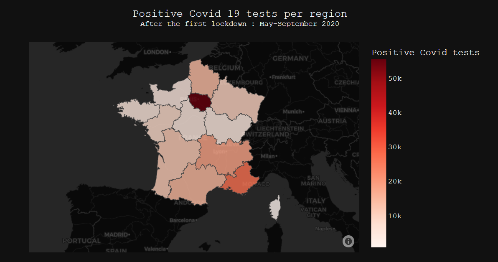
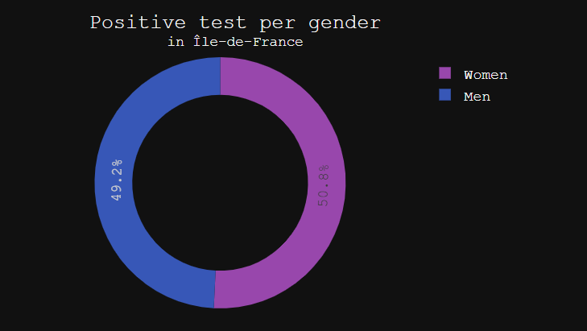

# Covid-19-FR
 Covid-19 France

This project is about data visualisation with Python using Geopandas/Folium and Plotly.

**The purpose of this project is to visualize Covid-19 positives tests per region on the France's map during the period after the first lockdown (May-Septembre 2020)**

 
here are screenshots of what the Juputer Notbook renders

Covid Positive test FR map with Folium

Covid Positive test FR map with Plotly

Covid positive test per gender in Île-de-France region

